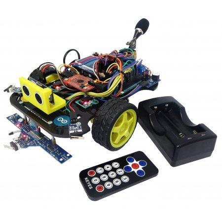

# ROBI PRO
Arduino konstruktor ROBI Pro

Project details [EST]: http://www.oomipood.ee/page/robipro

Assembly video: https://www.youtube.com/watch?v=JjuvWTSBP6o

[EST] Arduino konstruktor edasijõudnutele. ROBI Pro konstruktori komplekti kuuluvad erinevad andurid ja moodulid. Võimas Arduino Mega kontroller pakub laialt võimalusi. Kaasas 2 x 2600 mAh Samsung Li-Ion akud koos laadijaga. Roboti valmides on võimalik panna oma programmeerimisoskus proovile, lisada mooduleid või kirjutada robotile enda kood.

Tested with Arduino IDE 1.6.5-r2

